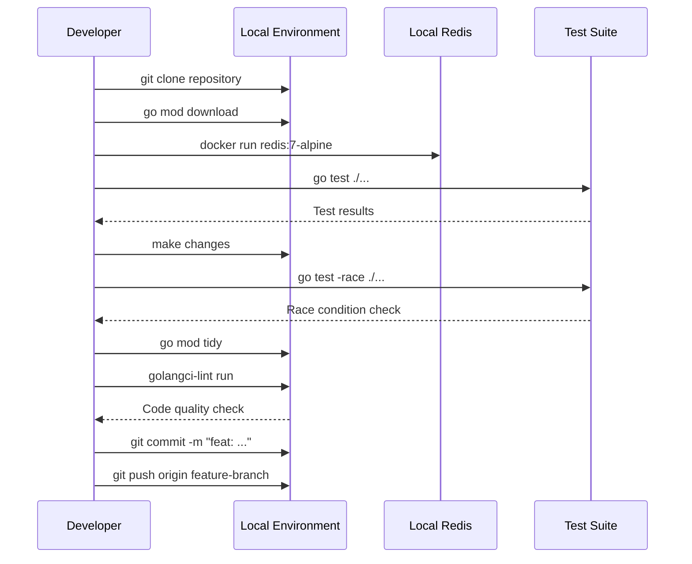

# Workflows và CI/CD

## Tổng quan

Redis Client Library được tích hợp với hệ thống CI/CD hoàn chỉnh để đảm bảo chất lượng code, tự động hóa testing, và quản lý phiên bản một cách hiệu quả.


## GitHub Actions Workflows

### 1. Continuous Integration (.github/workflows/ci.yml)

```yaml
name: Continuous Integration

on:
  push:
    branches: [ main, develop ]
  pull_request:
    branches: [ main ]

env:
  GO_VERSION: '1.23.9'

jobs:
  test:
    name: Test Suite
    runs-on: ubuntu-latest
    
    services:
      redis:
        image: redis:7-alpine
        ports:
          - 6379:6379
        options: >-
          --health-cmd "redis-cli ping"
          --health-interval 10s
          --health-timeout 5s
          --health-retries 5
    
    steps:
    - name: Checkout code
      uses: actions/checkout@v4
      
    - name: Setup Go
      uses: actions/setup-go@v5
      with:
        go-version: ${{ env.GO_VERSION }}
        
    - name: Cache Go modules
      uses: actions/cache@v3
      with:
        path: ~/go/pkg/mod
        key: ${{ runner.os }}-go-${{ hashFiles('**/go.sum') }}
        restore-keys: |
          ${{ runner.os }}-go-
    
    - name: Download dependencies
      run: go mod download
      
    - name: Verify dependencies
      run: go mod verify
      
    - name: Run tests
      run: |
        go test -v -race -coverprofile=coverage.out ./...
        
    - name: Generate coverage report
      run: go tool cover -html=coverage.out -o coverage.html
      
    - name: Upload coverage to Codecov
      uses: codecov/codecov-action@v3
      with:
        file: ./coverage.out
        
    - name: Run benchmarks
      run: go test -bench=. -benchmem ./...

  lint:
    name: Code Quality
    runs-on: ubuntu-latest
    
    steps:
    - name: Checkout code
      uses: actions/checkout@v4
      
    - name: Setup Go
      uses: actions/setup-go@v5
      with:
        go-version: ${{ env.GO_VERSION }}
        
    - name: golangci-lint
      uses: golangci/golangci-lint-action@v3
      with:
        version: latest
        
    - name: Go mod tidy check
      run: |
        go mod tidy
        git diff --exit-code go.mod go.sum

  security:
    name: Security Scan
    runs-on: ubuntu-latest
    
    steps:
    - name: Checkout code
      uses: actions/checkout@v4
      
    - name: Setup Go
      uses: actions/setup-go@v5
      with:
        go-version: ${{ env.GO_VERSION }}
        
    - name: Run Gosec Security Scanner
      uses: securecodewarrior/github-action-gosec@master
      with:
        args: './...'
        
    - name: Run Nancy vulnerability scanner
      run: |
        go list -json -m all | docker run --rm -i sonatypecommunity/nancy:latest sleuth

  integration:
    name: Integration Tests
    runs-on: ubuntu-latest
    
    strategy:
      matrix:
        redis-version: ['6.2', '7.0', '7.2']
        
    services:
      redis:
        image: redis:${{ matrix.redis-version }}-alpine
        ports:
          - 6379:6379
        options: >-
          --health-cmd "redis-cli ping"
          --health-interval 10s
          --health-timeout 5s
          --health-retries 5
    
    steps:
    - name: Checkout code
      uses: actions/checkout@v4
      
    - name: Setup Go
      uses: actions/setup-go@v5
      with:
        go-version: ${{ env.GO_VERSION }}
        
    - name: Run integration tests
      run: |
        go test -v -tags=integration ./...
      env:
        REDIS_URL: localhost:6379
```

### 2. Release Workflow (.github/workflows/release.yml)

```yaml
name: Release Management

on:
  push:
    tags:
      - 'v*'

env:
  GO_VERSION: '1.23.9'

jobs:
  release:
    name: Create Release
    runs-on: ubuntu-latest
    
    steps:
    - name: Checkout code
      uses: actions/checkout@v4
      with:
        fetch-depth: 0
        
    - name: Setup Go
      uses: actions/setup-go@v5
      with:
        go-version: ${{ env.GO_VERSION }}
        
    - name: Verify tag format
      run: |
        if [[ ! "${{ github.ref_name }}" =~ ^v[0-9]+\.[0-9]+\.[0-9]+$ ]]; then
          echo "Invalid tag format. Expected: vX.Y.Z"
          exit 1
        fi
        
    - name: Extract version
      id: version
      run: |
        VERSION=${GITHUB_REF#refs/tags/}
        echo "version=${VERSION}" >> $GITHUB_OUTPUT
        echo "version_number=${VERSION#v}" >> $GITHUB_OUTPUT
        
    - name: Validate release notes
      run: |
        RELEASE_NOTES_FILE="releases/${{ steps.version.outputs.version }}/RELEASE_NOTES.md"
        if [[ ! -f "$RELEASE_NOTES_FILE" ]]; then
          echo "Release notes not found: $RELEASE_NOTES_FILE"
          exit 1
        fi
        
    - name: Run full test suite
      run: |
        go test -v -race ./...
        
    - name: Build and verify
      run: |
        go build -v ./...
        go mod verify
        
    - name: Generate changelog entry
      run: |
        ./scripts/generate_changelog.sh ${{ steps.version.outputs.version }}
        
    - name: Create GitHub Release
      uses: actions/create-release@v1
      env:
        GITHUB_TOKEN: ${{ secrets.GITHUB_TOKEN }}
      with:
        tag_name: ${{ steps.version.outputs.version }}
        release_name: Release ${{ steps.version.outputs.version }}
        body_path: releases/${{ steps.version.outputs.version }}/RELEASE_NOTES.md
        draft: false
        prerelease: false
        
    - name: Archive release
      run: |
        ./scripts/archive_release.sh ${{ steps.version.outputs.version }}
        
    - name: Update Go module proxy
      run: |
        curl "https://proxy.golang.org/go.fork.vn/redis/@v/${{ steps.version.outputs.version }}.info"

  notify:
    name: Notify Stakeholders
    needs: release
    runs-on: ubuntu-latest
    
    steps:
    - name: Notify Slack
      uses: 8398a7/action-slack@v3
      with:
        status: success
        text: |
          🎉 New Redis Client Library release: ${{ steps.version.outputs.version }}
          
          📋 Release Notes: https://github.com/go-fork/redis/releases/tag/${{ steps.version.outputs.version }}
          📦 Go Module: go.fork.vn/redis@${{ steps.version.outputs.version }}
      env:
        SLACK_WEBHOOK_URL: ${{ secrets.SLACK_WEBHOOK_URL }}
```

### 3. Dependency Update (.github/workflows/update-deps.yml)

```yaml
name: Update Dependencies

on:
  schedule:
    - cron: '0 2 * * 1'  # Monday 2 AM UTC
  workflow_dispatch:

jobs:
  update-deps:
    name: Update Go Dependencies
    runs-on: ubuntu-latest
    
    steps:
    - name: Checkout code
      uses: actions/checkout@v4
      with:
        token: ${{ secrets.DEPENDABOT_TOKEN }}
        
    - name: Setup Go
      uses: actions/setup-go@v5
      with:
        go-version: '1.23.9'
        
    - name: Update dependencies
      run: |
        go get -u ./...
        go mod tidy
        
    - name: Run tests
      run: go test -v ./...
      
    - name: Create Pull Request
      uses: peter-evans/create-pull-request@v5
      with:
        token: ${{ secrets.DEPENDABOT_TOKEN }}
        commit-message: 'deps: update Go dependencies'
        title: 'chore: update Go dependencies'
        body: |
          🤖 Automated dependency update
          
          This PR updates Go dependencies to their latest versions.
          
          ### Changes
          - Updated go.mod dependencies
          - Ran `go mod tidy`
          - All tests passing ✅
          
          ### Testing
          - [ ] Unit tests pass
          - [ ] Integration tests pass
          - [ ] No breaking changes detected
        branch: deps/update-go-dependencies
        delete-branch: true
```

## Development Workflow

### 1. Local Development Setup



### 2. Development Commands

```bash
# Setup local development
make setup

# Run all tests
make test

# Run tests with coverage
make test-coverage

# Run integration tests
make test-integration

# Run benchmarks
make benchmark

# Lint code
make lint

# Generate mocks
make generate-mocks

# Clean artifacts
make clean
```

### 3. Pre-commit Hooks

```bash
#!/bin/sh
# .git/hooks/pre-commit

set -e

echo "Running pre-commit checks..."

# Format code
echo "🔧 Formatting code..."
go fmt ./...

# Tidy modules
echo "📦 Tidying modules..."
go mod tidy

# Run tests
echo "🧪 Running tests..."
go test -short ./...

# Lint code
echo "🔍 Linting code..."
golangci-lint run

# Check for vulnerabilities
echo "🔒 Checking vulnerabilities..."
govulncheck ./...

echo "✅ Pre-commit checks passed!"
```

## Testing Strategy

### 1. Test Hierarchy


### 2. Unit Testing

```go
// manager_test.go
func TestManager_BasicOperations(t *testing.T) {
    tests := []struct {
        name     string
        config   *Config
        expected bool
    }{
        {
            name: "standard client enabled",
            config: &Config{
                Client: &ClientConfig{
                    Enabled: true,
                    Addr:    "localhost:6379",
                },
            },
            expected: true,
        },
        {
            name: "universal client enabled",
            config: &Config{
                Universal: &UniversalConfig{
                    Enabled: true,
                    Addrs:   []string{"localhost:6379"},
                },
            },
            expected: true,
        },
    }
    
    for _, tt := range tests {
        t.Run(tt.name, func(t *testing.T) {
            manager := NewManager(tt.config)
            defer manager.Close()
            
            ctx := context.Background()
            
            // Test SET operation
            err := manager.Set(ctx, "test:key", "test:value", time.Minute)
            require.NoError(t, err)
            
            // Test GET operation
            value, err := manager.Get(ctx, "test:key")
            require.NoError(t, err)
            assert.Equal(t, "test:value", value)
            
            // Test DEL operation
            deleted, err := manager.Del(ctx, "test:key")
            require.NoError(t, err)
            assert.Equal(t, int64(1), deleted)
        })
    }
}
```

### 3. Integration Testing

```go
//go:build integration
// +build integration

func TestRedisClusterIntegration(t *testing.T) {
    if testing.Short() {
        t.Skip("Skipping integration test in short mode")
    }
    
    config := &Config{
        Universal: &UniversalConfig{
            Enabled: true,
            Addrs: []string{
                "localhost:7001",
                "localhost:7002", 
                "localhost:7003",
            },
        },
    }
    
    manager := NewManager(config)
    defer manager.Close()
    
    ctx := context.Background()
    
    // Test cluster-wide operations
    t.Run("cluster operations", func(t *testing.T) {
        // Test operations across different hash slots
        keys := []string{
            "user:1",    // Different hash slots
            "user:2",
            "user:3",
            "session:a",
            "session:b",
        }
        
        // Set values
        for i, key := range keys {
            value := fmt.Sprintf("value:%d", i)
            err := manager.Set(ctx, key, value, time.Hour)
            require.NoError(t, err)
        }
        
        // Get values
        for i, key := range keys {
            expectedValue := fmt.Sprintf("value:%d", i)
            actualValue, err := manager.Get(ctx, key)
            require.NoError(t, err)
            assert.Equal(t, expectedValue, actualValue)
        }
    })
}
```

### 4. Performance Testing

```go
func BenchmarkManager_Set(b *testing.B) {
    manager := setupBenchmarkManager()
    defer manager.Close()
    
    ctx := context.Background()
    
    b.ResetTimer()
    b.RunParallel(func(pb *testing.PB) {
        i := 0
        for pb.Next() {
            key := fmt.Sprintf("bench:key:%d", i)
            value := fmt.Sprintf("bench:value:%d", i)
            
            if err := manager.Set(ctx, key, value, time.Hour); err != nil {
                b.Fatalf("Set failed: %v", err)
            }
            i++
        }
    })
}

func BenchmarkManager_Get(b *testing.B) {
    manager := setupBenchmarkManager()
    defer manager.Close()
    
    ctx := context.Background()
    
    // Setup test data
    for i := 0; i < 1000; i++ {
        key := fmt.Sprintf("bench:key:%d", i)
        value := fmt.Sprintf("bench:value:%d", i)
        manager.Set(ctx, key, value, time.Hour)
    }
    
    b.ResetTimer()
    b.RunParallel(func(pb *testing.PB) {
        i := 0
        for pb.Next() {
            key := fmt.Sprintf("bench:key:%d", i%1000)
            
            _, err := manager.Get(ctx, key)
            if err != nil {
                b.Fatalf("Get failed: %v", err)
            }
            i++
        }
    })
}
```

## Release Management

### 1. Version Strategy

```mermaid
graph LR
    A[Development] --> B[Feature Branch]
    B --> C[Pull Request]
    C --> D[Code Review]
    D --> E[Merge to Main]
    E --> F[Pre-release Testing]
    F --> G[Version Tag]
    G --> H[Release Creation]
    H --> I[Go Module Proxy]
    
    subgraph "Version Types"
        J[Patch: v0.1.3 → v0.1.4]
        K[Minor: v0.1.3 → v0.2.0]
        L[Major: v0.1.3 → v1.0.0]
    end
    
    G --> J
    G --> K
    G --> L
```



### 2. Release Scripts

```bash
#!/bin/bash
# scripts/create_release.sh

set -e

VERSION=$1
if [[ -z "$VERSION" ]]; then
    echo "Usage: $0 <version>"
    echo "Example: $0 v0.1.4"
    exit 1
fi

# Validate version format
if [[ ! "$VERSION" =~ ^v[0-9]+\.[0-9]+\.[0-9]+$ ]]; then
    echo "Invalid version format. Expected: vX.Y.Z"
    exit 1
fi

echo "Creating release $VERSION..."

# Create release directory
RELEASE_DIR="releases/$VERSION"
mkdir -p "$RELEASE_DIR"

# Generate release notes template
cat > "$RELEASE_DIR/RELEASE_NOTES.md" << EOF
# Release $VERSION

## 🚀 Features

## 🐛 Bug Fixes

## 📚 Documentation

## 🔧 Maintenance

## ⚠️ Breaking Changes

## 📦 Dependencies

EOF

# Generate migration guide template
cat > "$RELEASE_DIR/MIGRATION.md" << EOF
# Migration Guide: $VERSION

## Overview

This document describes the changes and migration steps for $VERSION.

## Breaking Changes

None.

## New Features

## Deprecated Features

## Migration Steps

1. Update your go.mod:
   \`\`\`bash
   go get go.fork.vn/redis@$VERSION
   \`\`\`

2. Update your code (if needed):
   \`\`\`go
   // No code changes required
   \`\`\`

3. Test your application:
   \`\`\`bash
   go test ./...
   \`\`\`

EOF

echo "Release templates created in $RELEASE_DIR"
echo "Please edit the release notes and migration guide before tagging."
```

### 3. Automated Release Process

```bash
#!/bin/bash
# scripts/publish_release.sh

set -e

VERSION=$1
if [[ -z "$VERSION" ]]; then
    echo "Usage: $0 <version>"
    exit 1
fi

echo "Publishing release $VERSION..."

# Verify release notes exist
RELEASE_NOTES="releases/$VERSION/RELEASE_NOTES.md"
if [[ ! -f "$RELEASE_NOTES" ]]; then
    echo "Release notes not found: $RELEASE_NOTES"
    exit 1
fi

# Run full test suite
echo "Running tests..."
go test -v -race ./...

# Update changelog
echo "Updating changelog..."
./scripts/update_changelog.sh "$VERSION"

# Commit release changes
git add .
git commit -m "release: $VERSION"

# Create and push tag
git tag "$VERSION"
git push origin main
git push origin "$VERSION"

echo "Release $VERSION published successfully!"
```

## Monitoring và Observability

### 1. Metrics Collection


### 2. Health Checks

```go
// health.go
type HealthChecker struct {
    manager redis.Manager
}

func (h *HealthChecker) CheckRedisHealth(ctx context.Context) error {
    // Basic ping test
    if err := h.manager.Ping(ctx); err != nil {
        return fmt.Errorf("redis ping failed: %w", err)
    }
    
    // Test basic operations
    testKey := "health:check:" + time.Now().Format("20060102150405")
    
    if err := h.manager.Set(ctx, testKey, "ok", time.Minute); err != nil {
        return fmt.Errorf("redis set failed: %w", err)
    }
    
    value, err := h.manager.Get(ctx, testKey)
    if err != nil {
        return fmt.Errorf("redis get failed: %w", err)
    }
    
    if value != "ok" {
        return fmt.Errorf("redis health check failed: expected 'ok', got '%s'", value)
    }
    
    // Cleanup
    h.manager.Del(ctx, testKey)
    
    return nil
}
```

### 3. Distributed Tracing

```go
// tracing.go
type TracingManager struct {
    redis.Manager
    tracer trace.Tracer
}

func (t *TracingManager) Set(ctx context.Context, key string, value interface{}, expiration time.Duration) error {
    ctx, span := t.tracer.Start(ctx, "redis.set")
    defer span.End()
    
    span.SetAttributes(
        attribute.String("redis.operation", "set"),
        attribute.String("redis.key", key),
        attribute.String("redis.expiration", expiration.String()),
    )
    
    err := t.Manager.Set(ctx, key, value, expiration)
    if err != nil {
        span.RecordError(err)
        span.SetStatus(codes.Error, err.Error())
    }
    
    return err
}
```

---

**Kết thúc tài liệu workflows. Tiếp theo sẽ tạo README.md chính.**
