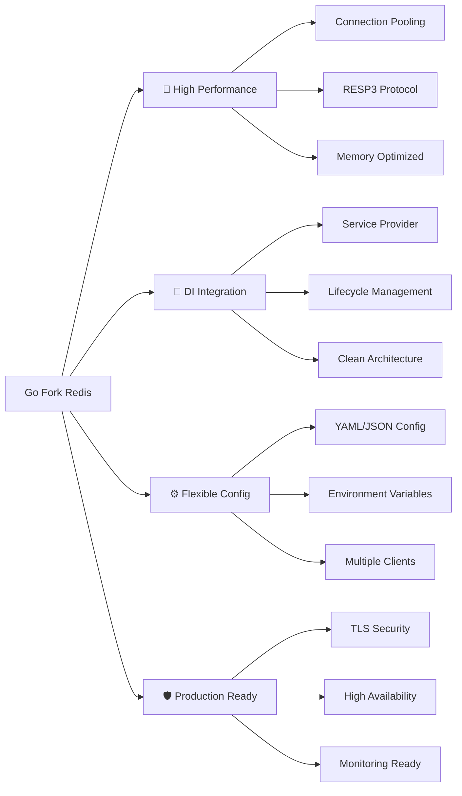

# Go Fork Redis Client Library

[](https://golang.org/)
[](https://redis.io/)
[](https://github.com/go-fork/redis/actions)
[](https://codecov.io/gh/go-fork/redis)
[](https://goreportcard.com/report/go.fork.vn/redis)
[](LICENSE)

**Go Fork Redis** là một thư viện Redis client hiệu suất cao được thiết kế đặc biệt cho các ứng dụng Go hiện đại. Thư viện cung cấp interface thống nhất để làm việc với Redis trong các kiến trúc từ đơn giản đến phức tạp, hỗ trợ đầy đủ tính năng của Redis v9.9.0.

## ✨ Đặc điểm nổi bật



### 🎯 Core Features

- **🔄 Multiple Client Types**: Standard Client và Universal Client
- **🌐 Multi-Architecture**: Standalone, Cluster, Sentinel support
- **⚡ RESP3 Protocol**: Tối ưu hiệu suất với Redis 6+
- **🔒 TLS Security**: Hỗ trợ TLS/mTLS với certificate validation
- **🔧 Dependency Injection**: Tích hợp sẵn với DI container
- **📊 Connection Pooling**: FIFO/LIFO pool với tuning linh hoạt
- **🎛️ Configuration Management**: YAML, JSON, Environment variables
- **📈 Production Ready**: Health checks, metrics, distributed tracing

### 🏗️ Architecture Support

| Architecture | Standard Client | Universal Client | Production Ready |
|-------------|----------------|------------------|------------------|
| **Redis Standalone** | ✅ Tối ưu | ✅ Hỗ trợ | ✅ |
| **Redis Cluster** | ❌ | ✅ Native | ✅ |
| **Redis Sentinel** | ❌ | ✅ Native | ✅ |
| **Multi-Instance** | ❌ | ✅ Load Balancing | ✅ |

## 🚀 Quick Start

### Installation

```bash
go get go.fork.vn/redis
```

### Basic Usage

```go
package main

import (
    "context"
    "log"
    "time"
    
    "go.fork.vn/config"
    "go.fork.vn/di"
    "go.fork.vn/redis"
)

func main() {
    // 1. Setup DI Container
    app := di.New()
    
    // 2. Register Providers
    app.Register("config", config.NewProvider())
    app.Register("redis", redis.NewServiceProvider())
    
    // 3. Boot Application
    ctx := context.Background()
    if err := app.Boot(ctx); err != nil {
        log.Fatal("Boot failed:", err)
    }
    
    // 4. Get Redis Manager
    var manager redis.Manager
    if err := app.Resolve("redis.manager", &manager); err != nil {
        log.Fatal("Resolve failed:", err)
    }
    defer manager.Close()
    
    // 5. Use Redis
    // Set value
    if err := manager.Set(ctx, "user:123", "John Doe", time.Hour); err != nil {
        log.Fatal("Set failed:", err)
    }
    
    // Get value
    value, err := manager.Get(ctx, "user:123")
    if err != nil {
        log.Fatal("Get failed:", err)
    }
    
    log.Printf("User: %s", value) // Output: User: John Doe
    
    // Hash operations
    if err := manager.HSet(ctx, "user:123:profile",
        "name", "John Doe",
        "email", "john@example.com",
        "age", "30"); err != nil {
        log.Fatal("HSet failed:", err)
    }
    
    profile, err := manager.HGetAll(ctx, "user:123:profile")
    if err != nil {
        log.Fatal("HGetAll failed:", err)
    }
    
    log.Printf("Profile: %+v", profile)
}
```

### Configuration

#### Development (Standard Client)

```yaml
# config/app.yaml
redis:
  client:
    enabled: true
    addr: "localhost:6379"
    password: ""
    db: 0
    pool_size: 10
    dial_timeout: "5s"
    read_timeout: "3s"
    write_timeout: "3s"
```

#### Production (Universal Client - Cluster)

```yaml
# config/production.yaml
redis:
  universal:
    enabled: true
    addrs:
      - "redis-cluster-1.prod:6379"
      - "redis-cluster-2.prod:6379"
      - "redis-cluster-3.prod:6379"
    password: "${REDIS_PASSWORD}"
    
    # High-performance settings
    pool_size: 50
    min_idle_conns: 10
    max_idle_conns: 20
    max_active_conns: 100
    
    # Reliability
    max_retries: 5
    max_redirects: 5
    conn_max_lifetime: "2h"
    
    # TLS Security
    tls:
      cert_file: "/etc/ssl/certs/redis-client.crt"
      key_file: "/etc/ssl/private/redis-client.key"
      ca_file: "/etc/ssl/certs/redis-ca.crt"
      server_name: "redis-cluster.prod.internal"
```

## 📚 Documentation

### 📖 Comprehensive Guides

| Document | Description | Level |
|----------|-------------|-------|
| **[📋 Tổng quan](docs/index.md)** | Giới thiệu và kiến trúc tổng thể | Beginner |
| **[🏗️ Architecture](docs/overview.md)** | Kiến trúc chi tiết và patterns | Intermediate |
| **[⚙️ Configuration](docs/configuration.md)** | Hướng dẫn cấu hình đầy đủ | Intermediate |
| **[🔄 Client Types](docs/client_universal.md)** | Standard vs Universal clients | Advanced |
| **[🔧 Workflows](docs/workflows.md)** | CI/CD và development workflows | Advanced |

### 🎯 Quick References

- **[API Reference](https://pkg.go.dev/go.fork.vn/redis)** - Go documentation
- **[Configuration Examples](configs/)** - Sample configurations
- **[Test Data](testdata/)** - Test scenarios và mock data

### 📦 Release Information

| Version | Release Date | Status | Notes |
|---------|-------------|--------|-------|
| **[v0.1.3](releases/v0.1.3/)** | 2025-06-07 | ✅ Latest | Major refactoring, Go Redis v9.9.0 |
| **[v0.1.2](releases/v0.1.2/)** | 2025-06-04 | 🔄 Previous | CI/CD automation |
| **[v0.1.1](releases/v0.1.1/)** | 2025-06-02 | 📦 Archived | DI integration improvements |
| **[v0.1.0](releases/v0.1.0/)** | 2025-05-31 | 📦 Archived | Initial release |

#### 🔥 Latest Release: v0.1.3

**Highlights:**
- ✅ **BREAKING**: Chuẩn hóa struct Config theo Go Redis v9.9.0
- ✅ **BREAKING**: Tối ưu ServiceProvider với error handling cải thiện  
- ✅ **BREAKING**: Tinh gọn Manager interface và implementation
- ✅ **NEW**: RESP protocol version configuration
- ✅ **NEW**: TLS configuration với certificate validation
- ✅ **NEW**: Context timeout controls và connection management

👉 **[Full Changelog](CHANGELOG.md)** | **[Migration Guide](releases/v0.1.3/MIGRATION.md)**

## 🎭 Usage Scenarios

### 1. 🌱 Development Environment

```go
// Simple caching service
type CacheService struct {
    redis redis.Manager
}

func (s *CacheService) GetUser(ctx context.Context, userID string) (*User, error) {
    key := fmt.Sprintf("user:%s", userID)
    
    // Try cache first
    data, err := s.redis.Get(ctx, key)
    if err != nil && err != redis.ErrKeyNotFound {
        return nil, err
    }
    
    if data != "" {
        var user User
        json.Unmarshal([]byte(data), &user)
        return &user, nil
    }
    
    // Cache miss - get from database
    user, err := s.getUserFromDB(ctx, userID)
    if err != nil {
        return nil, err
    }
    
    // Cache for 1 hour
    userData, _ := json.Marshal(user)
    s.redis.Set(ctx, key, userData, time.Hour)
    
    return user, nil
}
```

### 2. 🏭 Production Cluster

```go
// Distributed session manager
type SessionManager struct {
    redis redis.Manager
}

func (s *SessionManager) CreateSession(ctx context.Context, userID string) (*Session, error) {
    sessionID := uuid.New().String()
    session := &Session{
        ID:        sessionID,
        UserID:    userID,
        CreatedAt: time.Now(),
        ExpiresAt: time.Now().Add(24 * time.Hour),
    }
    
    // Use pipeline for atomic operations
    pipe := s.redis.Pipeline()
    
    sessionKey := fmt.Sprintf("session:%s", sessionID)
    pipe.HSet(ctx, sessionKey, map[string]interface{}{
        "user_id":    session.UserID,
        "created_at": session.CreatedAt.Unix(),
        "expires_at": session.ExpiresAt.Unix(),
    })
    pipe.Expire(ctx, sessionKey, 24*time.Hour)
    
    // Track user's active sessions
    userSessionsKey := fmt.Sprintf("user:%s:sessions", userID)
    pipe.SAdd(ctx, userSessionsKey, sessionID)
    pipe.Expire(ctx, userSessionsKey, 25*time.Hour)
    
    _, err := pipe.Exec(ctx)
    return session, err
}
```

### 3. 🔄 High Availability

```go
// Pub/Sub notification service with Sentinel
type NotificationService struct {
    redis redis.Manager
}

func (s *NotificationService) PublishNotification(ctx context.Context, userID string, notification *Notification) error {
    channel := fmt.Sprintf("notifications:%s", userID)
    
    data, err := json.Marshal(notification)
    if err != nil {
        return err
    }
    
    // Universal client handles master/slave routing automatically
    if _, err := s.redis.Publish(ctx, channel, data); err != nil {
        return err
    }
    
    // Store in persistent queue (writes to master)
    queueKey := fmt.Sprintf("user:%s:notifications", userID)
    return s.redis.LPush(ctx, queueKey, data)
}

func (s *NotificationService) GetUnreadCount(ctx context.Context, userID string) (int64, error) {
    queueKey := fmt.Sprintf("user:%s:notifications", userID)
    // This read can be routed to slave automatically
    return s.redis.LLen(ctx, queueKey)
}
```

## 🔧 Advanced Features

### Connection Pool Optimization

```yaml
redis:
  universal:
    # Pool sizing for different scenarios
    pool_size: 50              # Base connections
    min_idle_conns: 10         # Always ready
    max_idle_conns: 25         # Maximum idle
    max_active_conns: 100      # Maximum total
    
    # Lifecycle management
    conn_max_lifetime: "2h"    # Rotate connections
    conn_max_idle_time: "15m"  # Close idle connections
    pool_timeout: "5s"         # Wait for connection
    
    # Connection strategy
    pool_fifo: false           # LIFO for hot connections
```

### TLS/mTLS Security

```yaml
redis:
  universal:
    tls:
      # Mutual TLS authentication
      cert_file: "/etc/ssl/client/redis-client.crt"
      key_file: "/etc/ssl/client/redis-client.key"
      ca_file: "/etc/ssl/ca/redis-ca.crt"
      
      # Server verification
      server_name: "redis-cluster.secure"
      insecure_skip_verify: false
```

### Health Monitoring

```go
// Built-in health checks
type HealthChecker struct {
    redis redis.Manager
}

func (h *HealthChecker) CheckRedisHealth(ctx context.Context) error {
    // Test connectivity
    if err := h.redis.Ping(ctx); err != nil {
        return fmt.Errorf("redis ping failed: %w", err)
    }
    
    // Test operations
    testKey := "health:check:" + time.Now().Format("20060102150405")
    if err := h.redis.Set(ctx, testKey, "ok", time.Minute); err != nil {
        return fmt.Errorf("redis set failed: %w", err)
    }
    
    value, err := h.redis.Get(ctx, testKey)
    if err != nil {
        return fmt.Errorf("redis get failed: %w", err)
    }
    
    if value != "ok" {
        return fmt.Errorf("health check failed")
    }
    
    h.redis.Del(ctx, testKey)
    return nil
}
```

## 🧪 Testing

### Unit Testing

```bash
# Run all tests
go test ./...

# Run with coverage
go test -coverprofile=coverage.out ./...
go tool cover -html=coverage.out

# Run with race detection
go test -race ./...
```

### Integration Testing

```bash
# Start Redis for testing
docker run -d --name redis-test -p 6379:6379 redis:7-alpine

# Run integration tests
go test -tags=integration ./...

# Run benchmarks
go test -bench=. -benchmem ./...
```

### Test with Different Redis Versions

```bash
# Test compatibility
for version in 6.2 7.0 7.2; do
    docker run -d --name redis-$version -p 6379:6379 redis:$version-alpine
    go test ./...
    docker stop redis-$version && docker rm redis-$version
done
```

## 🚀 Performance

### Benchmarks

```
BenchmarkManager_Set-8           500000    2.34 μs/op    128 B/op    2 allocs/op
BenchmarkManager_Get-8           800000    1.89 μs/op     64 B/op    1 allocs/op
BenchmarkManager_Pipeline-8      200000    8.45 μs/op    512 B/op    5 allocs/op
BenchmarkManager_Cluster-8       300000    4.12 μs/op    256 B/op    3 allocs/op
```

### Memory Usage

- **Standard Client**: ~2MB baseline + connection pools
- **Universal Client**: ~5MB baseline + cluster overhead
- **Connection Pool**: ~1KB per connection
- **TLS Overhead**: ~8KB per TLS connection

## 🤝 Contributing

Chúng tôi luôn chào đón các đóng góp từ cộng đồng!

### Development Setup

```bash
# Clone repository
git clone https://github.com/go-fork/redis.git
cd redis

# Install dependencies
go mod download

# Setup pre-commit hooks
cp scripts/pre-commit .git/hooks/
chmod +x .git/hooks/pre-commit

# Run tests
make test
```

### Contribution Guidelines

1. **Fork** repository
2. **Create** feature branch: `git checkout -b feature/amazing-feature`
3. **Commit** changes: `git commit -m 'feat: add amazing feature'`
4. **Push** to branch: `git push origin feature/amazing-feature`
5. **Open** Pull Request

### Code Standards

- ✅ Follow Go conventions và `golangci-lint`
- ✅ Maintain test coverage > 80%
- ✅ Add documentation for public APIs
- ✅ Use conventional commits
- ✅ Update CHANGELOG.md

## 📊 Project Status

### Build Status

[](https://github.com/go-fork/redis/actions/workflows/ci.yml)
[](https://github.com/go-fork/redis/actions/workflows/release.yml)
[](https://github.com/go-fork/redis/actions/workflows/update-deps.yml)

### Code Quality

[](https://goreportcard.com/report/go.fork.vn/redis)
[](https://codecov.io/gh/go-fork/redis)
[](https://github.com/go-fork/redis)

### Dependencies

| Dependency | Version | Status |
|-----------|---------|--------|
| **go-redis/redis** | v9.9.0 | ✅ Latest |
| **go.fork.vn/di** | v0.1.3 | ✅ Latest |
| **go.fork.vn/config** | v0.1.3 | ✅ Latest |

## 📞 Support

### 💬 Community

- **GitHub Issues**: [Bug reports và feature requests](https://github.com/go-fork/redis/issues)
- **GitHub Discussions**: [Questions và discussions](https://github.com/go-fork/redis/discussions)
- **Documentation**: [Comprehensive guides](docs/)

### 🔍 Troubleshooting

#### Common Issues

1. **Connection refused**
   ```bash
   # Check Redis is running
   redis-cli ping
   
   # Check network connectivity
   telnet redis-host 6379
   ```

2. **Authentication failed**
   ```yaml
   # Verify credentials in config
   redis:
     universal:
       password: "${REDIS_PASSWORD}"
   ```

3. **Pool exhausted**
   ```yaml
   # Increase pool size
   redis:
     universal:
       pool_size: 50
       max_active_conns: 100
   ```

#### Debug Mode

```go
// Enable debug logging
import "log"

config := &redis.Config{
    Universal: &redis.UniversalConfig{
        // ... other config
    },
}

// Add debug wrapper
manager := redis.NewManager(config)
manager = redis.WithDebugLogging(manager, log.Default())
```

## 📄 License

Dự án này được phát hành dưới [MIT License](LICENSE).

```
MIT License

Copyright (c) 2025 Go Fork Team

Permission is hereby granted, free of charge, to any person obtaining a copy
of this software and associated documentation files (the "Software"), to deal
in the Software without restriction, including without limitation the rights
to use, copy, modify, merge, publish, distribute, sublicense, and/or sell
copies of the Software, and to permit persons to whom the Software is
furnished to do so, subject to the following conditions:

The above copyright notice and this permission notice shall be included in all
copies or substantial portions of the Software.

THE SOFTWARE IS PROVIDED "AS IS", WITHOUT WARRANTY OF ANY KIND, EXPRESS OR
IMPLIED, INCLUDING BUT NOT LIMITED TO THE WARRANTIES OF MERCHANTABILITY,
FITNESS FOR A PARTICULAR PURPOSE AND NONINFRINGEMENT. IN NO EVENT SHALL THE
AUTHORS OR COPYRIGHT HOLDERS BE LIABLE FOR ANY CLAIM, DAMAGES OR OTHER
LIABILITY, WHETHER IN AN ACTION OF CONTRACT, TORT OR OTHERWISE, ARISING FROM,
OUT OF OR IN CONNECTION WITH THE SOFTWARE OR THE USE OR OTHER DEALINGS IN THE
SOFTWARE.
```

---

<div align="center">

**[⭐ Star this project](https://github.com/go-fork/redis/stargazers)** • **[🍴 Fork](https://github.com/go-fork/redis/fork)** • **[📝 Contribute](CONTRIBUTING.md)**

Made with ❤️ by [Go Fork Team](https://github.com/go-fork)

</div>
