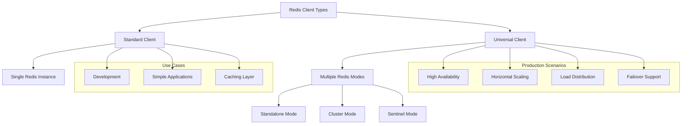
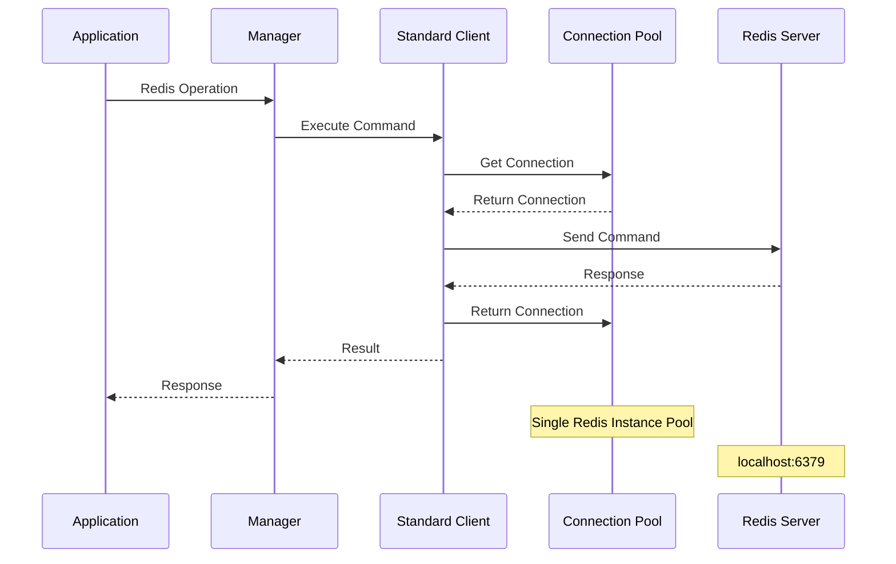
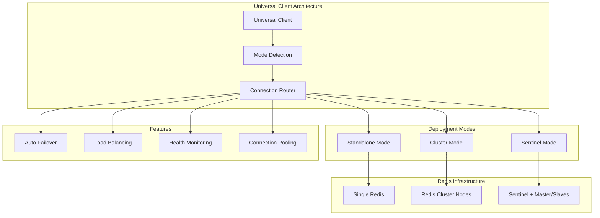
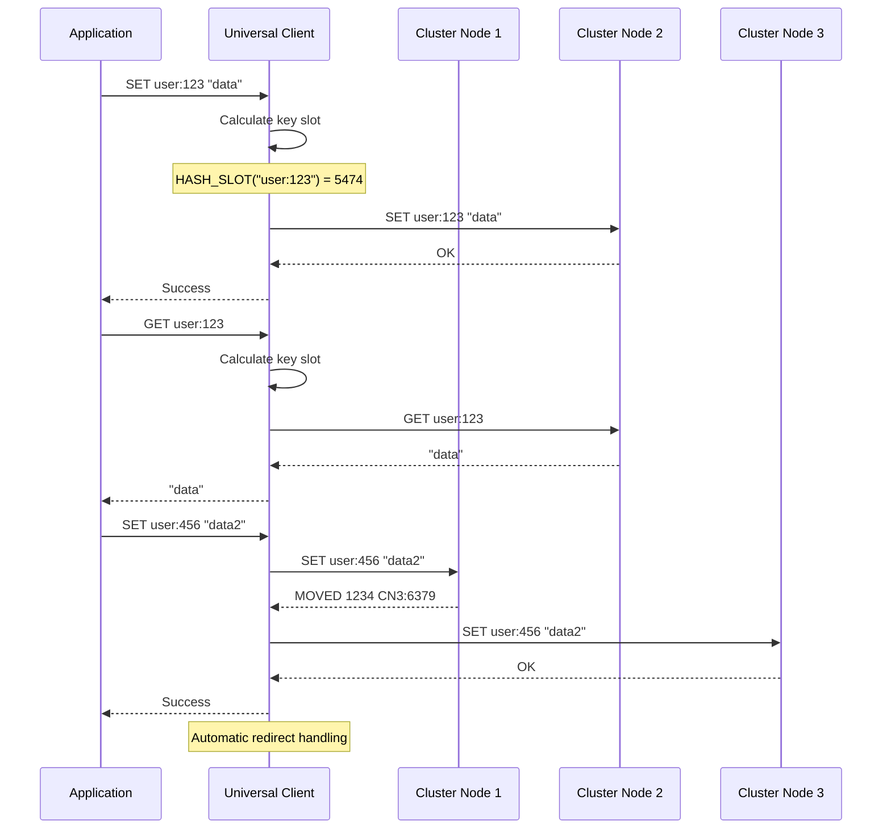
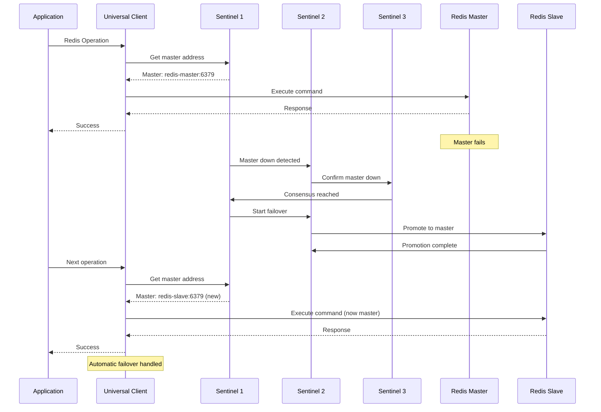
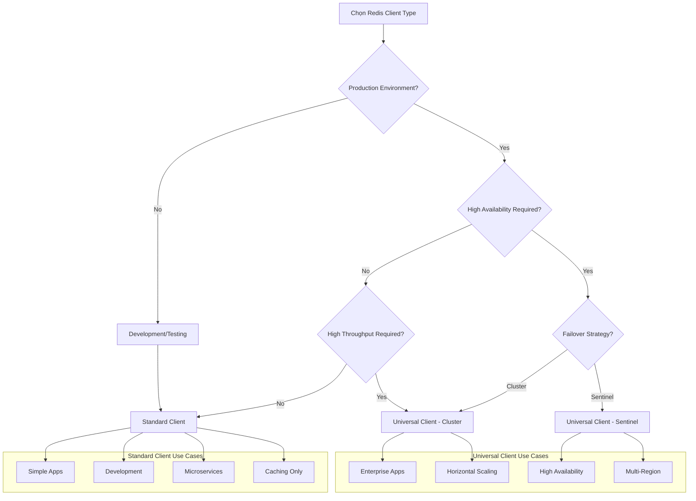

# Standard Client vs Universal Client

## Tổng quan

Redis Client Library cung cấp hai loại client chính để phục vụ các nhu cầu khác nhau trong ứng dụng:



## Standard Client (ClientConfig)

### Mục đích sử dụng

Standard Client được thiết kế cho các kết nối đơn giản đến một Redis instance duy nhất. Đây là lựa chọn tối ưu cho:

- ✅ **Development environment**
- ✅ **Simple applications** với single Redis
- ✅ **Caching layer** cho ứng dụng nhỏ
- ✅ **Testing** và prototyping
- ✅ **Microservices** với Redis dedicated

### Kiến trúc Standard Client



### Cấu hình Standard Client

```yaml
redis:
  client:
    enabled: true
    
    # Connection settings
    network: "tcp"
    addr: "localhost:6379"
    username: ""
    password: "simple-password"
    db: 0
    
    # Performance tuning
    pool_size: 10
    min_idle_conns: 2
    max_idle_conns: 5
    
    # Timeouts
    dial_timeout: "5s"
    read_timeout: "3s"
    write_timeout: "3s"
    
    # Client identification
    client_name: "my-simple-app"
    protocol: 3
```

### Ví dụ sử dụng Standard Client

```go
package main

import (
    "context"
    "log"
    "time"
    
    "go.fork.vn/config"
    "go.fork.vn/di"
    "go.fork.vn/redis"
)

func main() {
    // Setup DI container
    app := di.New()
    
    // Register providers
    app.Register("config", config.NewProvider())
    app.Register("redis", redis.NewServiceProvider())
    
    // Boot application
    ctx := context.Background()
    if err := app.Boot(ctx); err != nil {
        log.Fatal("Failed to boot:", err)
    }
    
    // Get Redis manager
    var manager redis.Manager
    if err := app.Resolve("redis.manager", &manager); err != nil {
        log.Fatal("Failed to resolve redis manager:", err)
    }
    
    // Use Standard Client for simple operations
    if err := manager.Set(ctx, "user:1", "John Doe", time.Hour); err != nil {
        log.Fatal("Failed to set:", err)
    }
    
    value, err := manager.Get(ctx, "user:1")
    if err != nil {
        log.Fatal("Failed to get:", err)
    }
    
    log.Printf("User: %s", value)
    
    // Hash operations
    if err := manager.HSet(ctx, "user:1:profile", 
        "name", "John Doe",
        "email", "john@example.com",
        "age", "30"); err != nil {
        log.Fatal("Failed to hset:", err)
    }
    
    profile, err := manager.HGetAll(ctx, "user:1:profile")
    if err != nil {
        log.Fatal("Failed to hgetall:", err)
    }
    
    log.Printf("Profile: %+v", profile)
}
```

## Universal Client (UniversalConfig)

### Mục đích sử dụng

Universal Client là giải pháp mạnh mẽ hỗ trợ multiple Redis deployment patterns. Thích hợp cho:

- ✅ **Production environments** với high availability
- ✅ **Redis Cluster** để horizontal scaling
- ✅ **Redis Sentinel** cho failover tự động
- ✅ **Multi-instance** deployment
- ✅ **Enterprise applications** với reliability requirements

### Kiến trúc Universal Client



### 1. Standalone Mode

Tương tự Standard Client nhưng với flexibility cao hơn:

```yaml
redis:
  universal:
    enabled: true
    addrs:
      - "redis-primary:6379"
    password: "production-password"
    db: 0
    
    # Enhanced pooling for production
    pool_size: 25
    min_idle_conns: 5
    max_idle_conns: 15
    max_active_conns: 50
    
    # Production timeouts
    dial_timeout: "3s"
    read_timeout: "2s"
    write_timeout: "2s"
    
    # Reliability settings
    max_retries: 5
    min_retry_backoff: "100ms"
    max_retry_backoff: "2s"
```

### 2. Redis Cluster Mode

Cho horizontal scaling và high throughput:

```yaml
redis:
  universal:
    enabled: true
    
    # Cluster nodes
    addrs:
      - "redis-cluster-1:6379"
      - "redis-cluster-2:6379"
      - "redis-cluster-3:6379"
      - "redis-cluster-4:6379"
      - "redis-cluster-5:6379"
      - "redis-cluster-6:6379"
    
    password: "${REDIS_CLUSTER_PASSWORD}"
    
    # Cluster-specific settings
    max_redirects: 5           # Handle cluster redirects
    read_only: false           # Allow writes to all nodes
    route_by_latency: true     # Route to fastest node
    route_randomly: false      # Deterministic routing
    
    # High-performance pooling
    pool_size: 50
    min_idle_conns: 10
    max_idle_conns: 25
    max_active_conns: 100
    
    # Aggressive connection management
    conn_max_lifetime: "2h"
    conn_max_idle_time: "15m"
```

#### Cluster operations workflow



### 3. Redis Sentinel Mode

Cho high availability với automatic failover:

```yaml
redis:
  universal:
    enabled: true
    
    # Sentinel addresses
    addrs:
      - "sentinel-1:26379"
      - "sentinel-2:26379"
      - "sentinel-3:26379"
    
    # Master configuration
    master_name: "redis-master"
    password: "${REDIS_PASSWORD}"
    sentinel_password: "${SENTINEL_PASSWORD}"
    
    # HA settings
    read_only: true            # Allow reads from slaves
    route_by_latency: true     # Route reads to closest slave
    route_randomly: false
    
    # Failover tuning
    max_retries: 8
    max_redirects: 10
    dial_timeout: "2s"
    
    # Connection pooling for HA
    pool_size: 30
    min_idle_conns: 8
    max_idle_conns: 20
```

#### Sentinel failover workflow



## So sánh Client Types

### Performance Comparison

| Metric | Standard Client | Universal Client |
|--------|----------------|------------------|
| **Latency** | Thấp nhất (direct connection) | Thấp (với overhead nhỏ) |
| **Throughput** | Giới hạn bởi single instance | Cao (cluster scaling) |
| **Memory Usage** | Tối thiểu | Cao hơn (multiple connections) |
| **CPU Overhead** | Thấp nhất | Trung bình (routing logic) |
| **Scalability** | Vertical only | Horizontal scaling |

### Feature Comparison

| Feature | Standard Client | Universal Client |
|---------|----------------|------------------|
| **Single Redis** | ✅ Tối ưu | ✅ Hỗ trợ |
| **Redis Cluster** | ❌ Không hỗ trợ | ✅ Native support |
| **Redis Sentinel** | ❌ Không hỗ trợ | ✅ Native support |
| **Failover** | ❌ Manual | ✅ Automatic |
| **Load Balancing** | ❌ Không có | ✅ Built-in |
| **Multi-DB** | ✅ DB 0-15 | ✅ DB 0-15 |
| **Pub/Sub** | ✅ Đầy đủ | ✅ Đầy đủ |
| **Transactions** | ✅ Đầy đủ | ⚠️ Limited (cluster) |
| **Lua Scripts** | ✅ Đầy đủ | ⚠️ Single key (cluster) |

### Use Case Decision Matrix



## Code Examples

### Standard Client Example

```go
// Simple caching service
type CacheService struct {
    redis redis.Manager
}

func (s *CacheService) GetUser(ctx context.Context, userID string) (*User, error) {
    key := fmt.Sprintf("user:%s", userID)
    
    // Try cache first
    data, err := s.redis.Get(ctx, key)
    if err != nil && err != redis.ErrKeyNotFound {
        return nil, err
    }
    
    if data != "" {
        var user User
        if err := json.Unmarshal([]byte(data), &user); err != nil {
            return nil, err
        }
        return &user, nil
    }
    
    // Cache miss - get from database
    user, err := s.getUserFromDB(ctx, userID)
    if err != nil {
        return nil, err
    }
    
    // Cache for 1 hour
    userData, _ := json.Marshal(user)
    s.redis.Set(ctx, key, userData, time.Hour)
    
    return user, nil
}
```

### Universal Client - Cluster Example

```go
// Distributed session manager
type SessionManager struct {
    redis redis.Manager
}

func (s *SessionManager) CreateSession(ctx context.Context, userID string) (*Session, error) {
    sessionID := uuid.New().String()
    session := &Session{
        ID:        sessionID,
        UserID:    userID,
        CreatedAt: time.Now(),
        ExpiresAt: time.Now().Add(24 * time.Hour),
    }
    
    // Use hash to store session data
    sessionKey := fmt.Sprintf("session:%s", sessionID)
    
    pipe := s.redis.Pipeline()
    pipe.HSet(ctx, sessionKey, map[string]interface{}{
        "user_id":    session.UserID,
        "created_at": session.CreatedAt.Unix(),
        "expires_at": session.ExpiresAt.Unix(),
    })
    pipe.Expire(ctx, sessionKey, 24*time.Hour)
    
    // Add to user's active sessions set
    userSessionsKey := fmt.Sprintf("user:%s:sessions", userID)
    pipe.SAdd(ctx, userSessionsKey, sessionID)
    pipe.Expire(ctx, userSessionsKey, 25*time.Hour) // Slightly longer than sessions
    
    _, err := pipe.Exec(ctx)
    if err != nil {
        return nil, fmt.Errorf("failed to create session: %w", err)
    }
    
    return session, nil
}

func (s *SessionManager) GetActiveSessionsCount(ctx context.Context, userID string) (int64, error) {
    userSessionsKey := fmt.Sprintf("user:%s:sessions", userID)
    return s.redis.SCard(ctx, userSessionsKey)
}
```

### Universal Client - Sentinel Example

```go
// High availability service
type NotificationService struct {
    redis redis.Manager
}

func (s *NotificationService) PublishNotification(ctx context.Context, userID string, notification *Notification) error {
    // Publish to user-specific channel
    channel := fmt.Sprintf("notifications:%s", userID)
    
    data, err := json.Marshal(notification)
    if err != nil {
        return err
    }
    
    // Universal client automatically routes to current master
    _, err = s.redis.Publish(ctx, channel, data)
    if err != nil {
        return fmt.Errorf("failed to publish notification: %w", err)
    }
    
    // Also store in persistent queue (writes to master)
    queueKey := fmt.Sprintf("user:%s:notifications", userID)
    if err := s.redis.LPush(ctx, queueKey, data); err != nil {
        return fmt.Errorf("failed to queue notification: %w", err)
    }
    
    // Set expiration (writes to master)
    if err := s.redis.Expire(ctx, queueKey, 7*24*time.Hour); err != nil {
        // Log but don't fail
        log.Printf("Failed to set expiration: %v", err)
    }
    
    return nil
}

func (s *NotificationService) GetUnreadCount(ctx context.Context, userID string) (int64, error) {
    queueKey := fmt.Sprintf("user:%s:notifications", userID)
    
    // This read can be routed to slave by Universal client (if read_only: true)
    return s.redis.LLen(ctx, queueKey)
}
```

## Migration Strategies

### From Standard to Universal

```go
// Phase 1: Update configuration only
// redis:
//   client:
//     enabled: false  # Disable standard client
//   universal:
//     enabled: true
//     addrs: ["localhost:6379"]  # Same Redis instance
//     # ... other settings

// Phase 2: No code changes needed - same Manager interface

// Phase 3: Scale to cluster when ready
// redis:
//   universal:
//     addrs:
//       - "redis-1:6379"
//       - "redis-2:6379" 
//       - "redis-3:6379"
```

### Testing Strategy

```go
func TestClientMigration(t *testing.T) {
    // Test with both client types
    configs := []*redis.Config{
        // Standard client config
        {
            Client: &redis.ClientConfig{
                Enabled: true,
                Addr:    "localhost:6379",
            },
        },
        // Universal client config
        {
            Universal: &redis.UniversalConfig{
                Enabled: true,
                Addrs:   []string{"localhost:6379"},
            },
        },
    }
    
    for i, config := range configs {
        t.Run(fmt.Sprintf("config_%d", i), func(t *testing.T) {
            manager := redis.NewManager(config)
            defer manager.Close()
            
            // Test same operations work with both clients
            testBasicOperations(t, manager)
            testHashOperations(t, manager)
            testListOperations(t, manager)
        })
    }
}
```

---

**Tiếp theo**: [Workflows và CI/CD](workflows.md)
