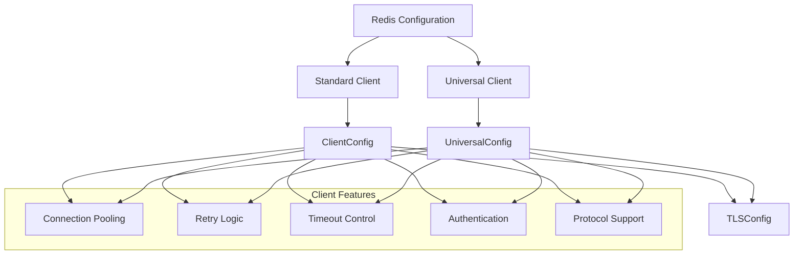

# Hướng dẫn cấu hình Redis Client

## Tổng quan cấu hình

Redis Client Library hỗ trợ hai loại client chính với cấu hình linh hoạt và đầy đủ tính năng của Redis v9.9.0:



## Cấu trúc cấu hình

### 1. Cấu hình gốc (Root Config)

```go
type Config struct {
    Client    *ClientConfig    `mapstructure:"client"`
    Universal *UniversalConfig `mapstructure:"universal"`
}
```

### 2. Standard Client Config

```yaml
redis:
  client:
    # Kích hoạt/tắt client
    enabled: true
    
    # Kết nối cơ bản
    network: "tcp"                    # tcp hoặc unix
    addr: "localhost:6379"            # Địa chỉ Redis server
    username: ""                      # Redis 6+ ACL username
    password: "your-password"         # Mật khẩu xác thực
    db: 0                            # Database number (0-15)
    client_name: "my-app"            # Tên client để monitoring
    
    # Protocol và timeout
    protocol: 3                      # RESP version (2 hoặc 3)
    dial_timeout: "5s"               # Timeout khi establish connection
    read_timeout: "3s"               # Timeout khi đọc response
    write_timeout: "3s"              # Timeout khi ghi request
    context_timeout_enabled: false   # Sử dụng context timeout
    
    # Retry logic
    max_retries: 3                   # Số lần retry tối đa
    min_retry_backoff: "8ms"         # Thời gian chờ tối thiểu giữa các retry
    max_retry_backoff: "512ms"       # Thời gian chờ tối đa giữa các retry
    
    # Connection pooling
    pool_fifo: false                 # true=FIFO, false=LIFO
    pool_size: 10                    # Số connection cơ bản
    pool_timeout: "4s"               # Timeout khi pool busy
    min_idle_conns: 0                # Số connection idle tối thiểu
    max_idle_conns: 0                # Số connection idle tối đa
    max_active_conns: 0              # Số connection active tối đa
    conn_max_idle_time: "30m"        # Thời gian idle tối đa
    conn_max_lifetime: "0s"          # Thời gian sống tối đa (0=unlimited)
    
    # Client identity
    disable_identity: false          # Tắt CLIENT SETINFO command
    identity_suffix: ""              # Suffix cho client name
    unstable_resp3: false           # Chế độ unstable cho Redis Search
    
    # TLS configuration
    tls:
      cert_file: "/path/to/client.crt"
      key_file: "/path/to/client.key"
      ca_file: "/path/to/ca.crt"
      server_name: "redis.example.com"
      insecure_skip_verify: false
```

### 3. Universal Client Config

```yaml
redis:
  universal:
    # Kích hoạt/tắt client
    enabled: true
    
    # Danh sách địa chỉ servers
    addrs:
      - "redis-1:6379"
      - "redis-2:6379"
      - "redis-3:6379"
    
    # Authentication
    username: ""                     # Redis 6+ ACL username
    password: "cluster-password"     # Mật khẩu Redis
    sentinel_username: ""            # Username cho Sentinel (nếu khác Redis)
    sentinel_password: ""            # Password cho Sentinel (nếu khác Redis)
    
    # Database và client
    db: 0                           # Database number
    client_name: "my-cluster-app"   # Tên client
    
    # Protocol settings
    protocol: 3                     # RESP version
    dial_timeout: "5s"
    read_timeout: "3s"
    write_timeout: "3s"
    context_timeout_enabled: false
    
    # Retry và error handling
    max_retries: 3
    min_retry_backoff: "8ms"
    max_retry_backoff: "512ms"
    max_redirects: 3                # Số redirect tối đa cho cluster
    
    # Connection pooling
    pool_fifo: false
    pool_size: 20                   # Lớn hơn standard client
    pool_timeout: "4s"
    min_idle_conns: 5
    max_idle_conns: 10
    max_active_conns: 50            # Nhiều hơn cho cluster
    conn_max_idle_time: "30m"
    conn_max_lifetime: "1h"
    
    # Cluster/Sentinel specific
    read_only: false                # Cho phép read từ slave
    route_by_latency: false         # Route theo latency thấp nhất
    route_randomly: false           # Route ngẫu nhiên
    master_name: "mymaster"         # Tên master cho Sentinel
    is_cluster_mode: false          # Force cluster mode với 1 addr
    
    # Client identity
    disable_identity: false
    identity_suffix: "-cluster"
    unstable_resp3: false
    
    # TLS cho cluster
    tls:
      cert_file: "/etc/ssl/cluster-client.crt"
      key_file: "/etc/ssl/cluster-client.key"
      ca_file: "/etc/ssl/cluster-ca.crt"
      server_name: "*.redis-cluster.internal"
      insecure_skip_verify: false
```

## Scenarios cấu hình

### 1. Development - Local Redis

```yaml
redis:
  client:
    enabled: true
    addr: "localhost:6379"
    password: ""
    db: 0
    pool_size: 5
    dial_timeout: "2s"
    read_timeout: "1s"
    write_timeout: "1s"
```

### 2. Production - Redis Cluster

```yaml
redis:
  universal:
    enabled: true
    addrs:
      - "redis-cluster-1.prod:6379"
      - "redis-cluster-2.prod:6379"
      - "redis-cluster-3.prod:6379"
      - "redis-cluster-4.prod:6379"
      - "redis-cluster-5.prod:6379"
      - "redis-cluster-6.prod:6379"
    password: "${REDIS_CLUSTER_PASSWORD}"
    
    # High performance settings
    pool_size: 50
    min_idle_conns: 10
    max_idle_conns: 20
    max_active_conns: 100
    
    # Reliability settings
    max_retries: 5
    max_redirects: 5
    conn_max_lifetime: "2h"
    
    # TLS for production
    tls:
      cert_file: "/etc/ssl/certs/redis-client.crt"
      key_file: "/etc/ssl/private/redis-client.key"
      ca_file: "/etc/ssl/certs/redis-ca.crt"
      server_name: "redis-cluster.prod.internal"
```

### 3. High Availability - Redis Sentinel

```yaml
redis:
  universal:
    enabled: true
    addrs:
      - "sentinel-1.ha:26379"
      - "sentinel-2.ha:26379"  
      - "sentinel-3.ha:26379"
    master_name: "redis-master"
    password: "${REDIS_PASSWORD}"
    sentinel_password: "${SENTINEL_PASSWORD}"
    
    # HA specific settings
    read_only: true              # Cho phép read từ slaves
    route_by_latency: true       # Route đến node gần nhất
    max_redirects: 8
    
    # Connection settings cho HA
    pool_size: 30
    min_idle_conns: 5
    max_idle_conns: 15
    dial_timeout: "3s"
    pool_timeout: "2s"
```

### 4. Microservices - Multiple Clients

```yaml
redis:
  # Cache client - fast, simple
  client:
    enabled: true
    addr: "redis-cache:6379"
    db: 0
    pool_size: 15
    read_timeout: "500ms"
    write_timeout: "500ms"
    
  # Session store - cluster for reliability  
  universal:
    enabled: true
    addrs:
      - "redis-session-1:6379"
      - "redis-session-2:6379"
      - "redis-session-3:6379"
    db: 1
    pool_size: 25
    max_retries: 3
    conn_max_lifetime: "1h"
```

## TLS Configuration

### 1. Cấu hình TLS cơ bản

```yaml
redis:
  client:
    enabled: true
    addr: "redis-tls.example.com:6380"
    tls:
      server_name: "redis-tls.example.com"
      insecure_skip_verify: false  # Luôn verify trong production
```

### 2. Mutual TLS (mTLS)

```yaml
redis:
  universal:
    enabled: true
    addrs: ["redis-cluster.secure:6379"]
    tls:
      cert_file: "/etc/ssl/client/redis-client.crt"
      key_file: "/etc/ssl/client/redis-client.key"
      ca_file: "/etc/ssl/ca/redis-ca.crt"
      server_name: "redis-cluster.secure"
      insecure_skip_verify: false
```

### 3. Self-signed certificates (Development)

```yaml
redis:
  client:
    enabled: true
    addr: "redis-dev:6379"
    tls:
      ca_file: "/dev/certs/self-signed-ca.crt"
      server_name: "redis-dev"
      insecure_skip_verify: false  # Vẫn sử dụng CA để verify
```

## Connection Pool Tuning

### 1. Low-latency applications

```yaml
redis:
  client:
    enabled: true
    # Nhiều connections sẵn sàng
    pool_size: 20
    min_idle_conns: 10
    max_idle_conns: 15
    
    # Timeout ngắn
    pool_timeout: "1s"
    dial_timeout: "500ms"
    
    # FIFO để tránh connection stale
    pool_fifo: true
    conn_max_idle_time: "5m"
```

### 2. High-throughput applications

```yaml
redis:
  universal:
    enabled: true
    # Pool lớn cho throughput cao
    pool_size: 100
    max_active_conns: 200
    min_idle_conns: 20
    max_idle_conns: 50
    
    # Timeout dài hơn để handle burst
    pool_timeout: "10s"
    conn_max_lifetime: "4h"
    
    # LIFO để tái sử dụng hot connections
    pool_fifo: false
```

### 3. Resource-constrained environments

```yaml
redis:
  client:
    enabled: true
    # Pool nhỏ để tiết kiệm memory
    pool_size: 3
    min_idle_conns: 1
    max_idle_conns: 2
    max_active_conns: 5
    
    # Timeout aggressive để giải phóng resources
    conn_max_idle_time: "2m"
    conn_max_lifetime: "30m"
    pool_timeout: "2s"
```

## Environment Variables

Sử dụng environment variables để bảo mật thông tin nhạy cảm:

```yaml
redis:
  universal:
    enabled: true
    addrs: 
      - "${REDIS_HOST_1:-redis-1}:${REDIS_PORT:-6379}"
      - "${REDIS_HOST_2:-redis-2}:${REDIS_PORT:-6379}"
    password: "${REDIS_PASSWORD:?REDIS_PASSWORD is required}"
    username: "${REDIS_USERNAME}"
    
    tls:
      cert_file: "${REDIS_CERT_FILE}"
      key_file: "${REDIS_KEY_FILE}"
      ca_file: "${REDIS_CA_FILE}"
      server_name: "${REDIS_SERVER_NAME}"
```

### Environment variables template

```bash
# Redis connection
export REDIS_HOST_1="redis-cluster-1.prod.internal"
export REDIS_HOST_2="redis-cluster-2.prod.internal"
export REDIS_HOST_3="redis-cluster-3.prod.internal"
export REDIS_PORT="6379"
export REDIS_PASSWORD="super-secure-password"
export REDIS_USERNAME="app-user"

# TLS certificates
export REDIS_CERT_FILE="/etc/ssl/certs/redis-client.crt"
export REDIS_KEY_FILE="/etc/ssl/private/redis-client.key"
export REDIS_CA_FILE="/etc/ssl/certs/redis-ca.crt"
export REDIS_SERVER_NAME="*.redis-cluster.prod.internal"
```

## Validation và Best Practices

### 1. Configuration validation

Library tự động validate configuration khi khởi tạo:

```go
// Các validation rules chính:
- addr không được rỗng
- db >= 0
- protocol phải là 2 hoặc 3
- pool_size >= 0
- min_idle_conns <= max_idle_conns
- max_retries >= -1
- TLS certificate files phải tồn tại
```

### 2. Best practices

```mermaid
graph TD
    A[Configuration Best Practices] --> B[Security]
    A --> C[Performance]
    A --> D[Reliability]
    A --> E[Monitoring]
    
    B --> B1[Use environment variables]
    B --> B2[Enable TLS in production]
    B --> B3[Use strong passwords]
    B --> B4[Limit database access]
    
    C --> C1[Tune pool sizes]
    C --> C2[Set appropriate timeouts]
    C --> C3[Use RESP3 protocol]
    C --> C4[Enable connection reuse]
    
    D --> D1[Configure retries]
    D --> D2[Set max redirects]
    D --> D3[Use health checks]
    D --> D4[Plan for failover]
    
    E --> E1[Set client names]
    E --> E2[Enable structured logging]
    E --> E3[Track pool metrics]
    E --> E4[Monitor connection health]
```



### 3. Common mistakes

❌ **Tránh những lỗi thường gặp:**

```yaml
# WRONG - Pool quá nhỏ cho high-load app
redis:
  client:
    pool_size: 1  # ❌ Sẽ gây bottle-neck

# WRONG - Timeout quá ngắn
redis:
  client:
    read_timeout: "10ms"  # ❌ Quá ngắn, sẽ timeout liên tục

# WRONG - Không sử dụng TLS trong production
redis:
  client:
    addr: "prod-redis:6379"  # ❌ Không mã hóa

# WRONG - Hard-code sensitive data
redis:
  client:
    password: "hardcoded-password"  # ❌ Không bảo mật
```

✅ **Best practices:**

```yaml
# CORRECT - Balanced configuration
redis:
  universal:
    enabled: true
    addrs: ["${REDIS_CLUSTER_ENDPOINTS}"]
    password: "${REDIS_PASSWORD:?Required}"
    
    # Appropriate pool sizing
    pool_size: 20
    min_idle_conns: 5
    max_idle_conns: 10
    
    # Reasonable timeouts
    dial_timeout: "3s"
    read_timeout: "2s" 
    write_timeout: "2s"
    
    # TLS enabled
    tls:
      cert_file: "${REDIS_CERT_FILE:?Required}"
      key_file: "${REDIS_KEY_FILE:?Required}"
      ca_file: "${REDIS_CA_FILE:?Required}"
      server_name: "${REDIS_SERVER_NAME:?Required}"
```

## Testing Configuration

### 1. Unit testing với mock config

```go
func TestManagerWithMockConfig() {
    config := &redis.Config{
        Client: &redis.ClientConfig{
            Enabled: true,
            Addr:    "localhost:6379",
            DB:      0,
        },
    }
    
    // Test configuration validation
    err := config.Validate()
    assert.NoError(t, err)
    
    // Test options generation
    opts := config.Options()
    assert.NotNil(t, opts)
    assert.Equal(t, "localhost:6379", opts.Addr)
}
```

### 2. Integration testing

```go
func TestRealRedisConnection() {
    // Load test configuration
    cfg := loadTestConfig()
    
    manager := redis.NewManager(cfg)
    defer manager.Close()
    
    ctx := context.Background()
    
    // Test basic operations
    err := manager.Set(ctx, "test:key", "test:value", time.Minute)
    assert.NoError(t, err)
    
    value, err := manager.Get(ctx, "test:key")
    assert.NoError(t, err)
    assert.Equal(t, "test:value", value)
}
```

---

**Tiếp theo**: [Client Types - Standard vs Universal](client_universal.md)
