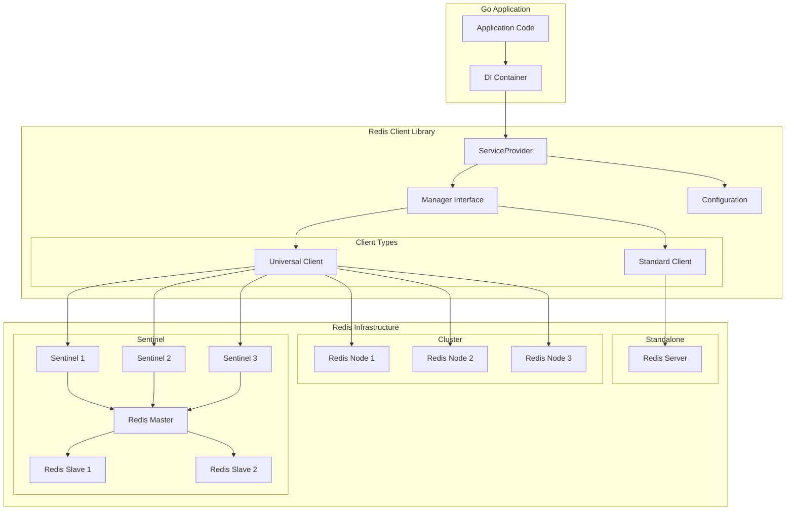

# Go Redis Client Library - Tài liệu chính thức

**Phiên bản hiện tại:** v0.1.3  
**Ngày cập nhật:** 07/06/2025  
**Tương thích:** Go 1.23.9+, Redis 6.0+

## Tổng quan

Go Fork Redis là một thư viện quản lý Redis client hiệu suất cao, được thiết kế để tích hợp dễ dàng với các ứng dụng Go. Thư viện này cung cấp một interface thống nhất để làm việc với Redis trong các kiến trúc khác nhau, từ standalone đến cluster và sentinel.

## Đặc điểm nổi bật

- ✅ **Đa dạng kiến trúc**: Hỗ trợ Redis Standalone, Cluster, và Sentinel
- ✅ **RESP3 Protocol**: Tương thích với Redis 6+ và RESP protocol version 3
- ✅ **Dependency Injection**: Tích hợp sẵn với DI container
- ✅ **Configuration Management**: Quản lý cấu hình linh hoạt
- ✅ **Connection Pooling**: Tối ưu hóa pool kết nối với FIFO/LIFO
- ✅ **TLS Security**: Hỗ trợ TLS với certificate validation
- ✅ **Context Timeout**: Kiểm soát timeout theo context
- ✅ **High Availability**: Failover tự động và load balancing
- ✅ **Performance**: Tối ưu memory và garbage collection

## Kiến trúc hệ thống



## Cài đặt nhanh

```bash
go get go.fork.vn/redis
```

## Sử dụng cơ bản

```go
package main

import (
    "context"
    "log"
    
    "go.fork.vn/config"
    "go.fork.vn/di"
    "go.fork.vn/redis"
)

func main() {
    // Khởi tạo DI container
    app := di.New()
    
    // Đăng ký config provider
    configProvider := config.NewProvider()
    app.Register("config", configProvider)
    
    // Đăng ký Redis service provider
    redisProvider := redis.NewServiceProvider()
    app.Register("redis", redisProvider)
    
    // Boot application
    if err := app.Boot(context.Background()); err != nil {
        log.Fatal(err)
    }
    
    // Lấy Redis manager
    var manager redis.Manager
    if err := app.Resolve("redis.manager", &manager); err != nil {
        log.Fatal(err)
    }
    
    // Sử dụng Redis
    ctx := context.Background()
    if err := manager.Set(ctx, "key", "value", 0); err != nil {
        log.Fatal(err)
    }
    
    val, err := manager.Get(ctx, "key")
    if err != nil {
        log.Fatal(err)
    }
    
    log.Printf("Value: %s", val)
}
```

## Cấu trúc tài liệu

### 📋 Tài liệu chính

- **[Tổng quan](overview.md)** - Kiến trúc và nguyên lý hoạt động
- **[Cấu hình](configuration.md)** - Hướng dẫn cấu hình chi tiết
- **[Client Types](client_universal.md)** - Standard vs Universal clients
- **[Workflows](workflows.md)** - Quy trình phát triển và CI/CD

### 🔧 Tài liệu kỹ thuật

- **[API Reference](https://pkg.go.dev/go.fork.vn/redis)** - Documentation đầy đủ
- **[Examples](../configs/)** - Các ví dụ cấu hình
- **[Test Data](../testdata/)** - Dữ liệu test và mock

### 📦 Thông tin phát hành

- **[Changelog](../CHANGELOG.md)** - Lịch sử thay đổi
- **[Releases](../releases/)** - Thông tin các phiên bản
- **[Migration Guides](../releases/)** - Hướng dẫn nâng cấp

## Yêu cầu hệ thống

| Thành phần | Phiên bản tối thiểu | Khuyến nghị |
|-----------|---------------------|-------------|
| Go        | 1.21+              | 1.23.9+     |
| Redis     | 6.0+               | 7.0+        |
| go-redis  | v9.9.0             | v9.9.0+     |

## Hỗ trợ

- **Repository**: [github.com/go-fork/redis](https://github.com/go-fork/redis)
- **Issues**: [GitHub Issues](https://github.com/go-fork/redis/issues)
- **Discussions**: [GitHub Discussions](https://github.com/go-fork/redis/discussions)

## Giấy phép

Dự án này được phát hành dưới [MIT License](../LICENSE).

---

**Ghi chú**: Tài liệu này được cập nhật liên tục. Vui lòng kiểm tra phiên bản mới nhất tại [repository chính thức](https://github.com/go-fork/redis).
