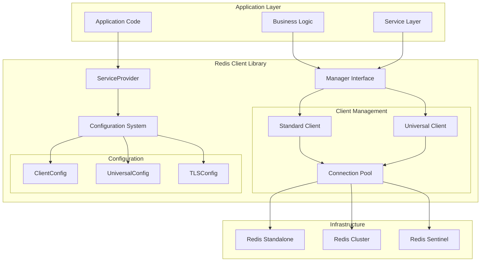
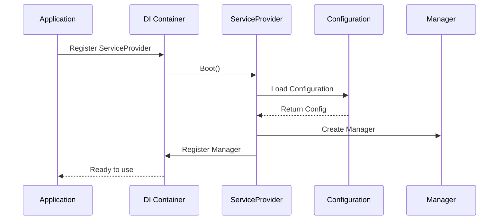
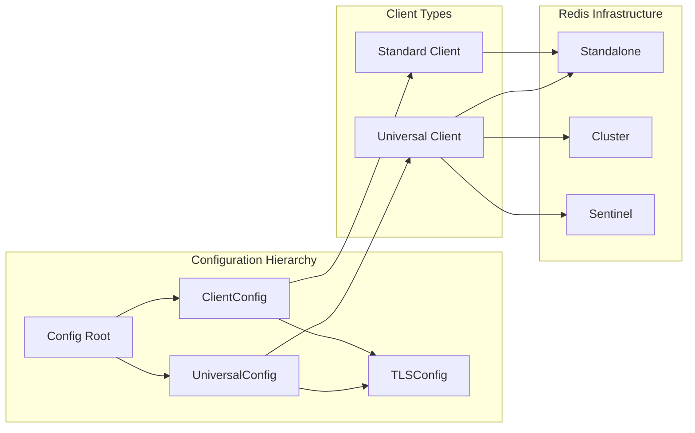
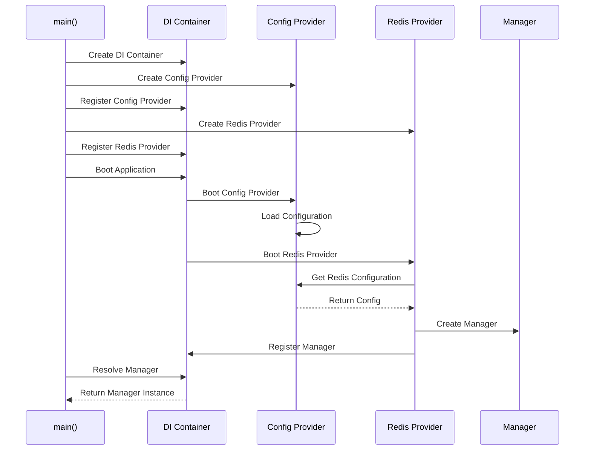
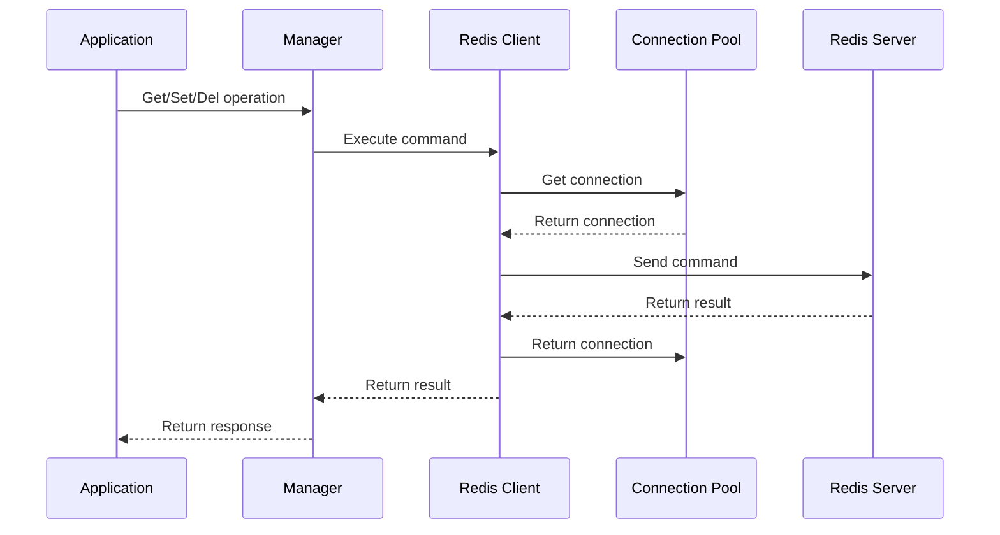
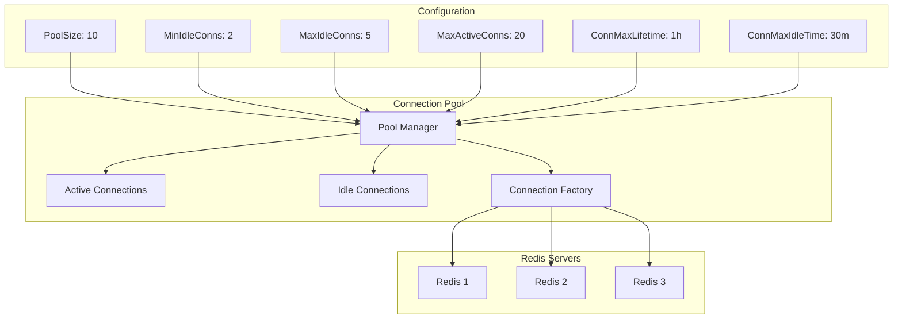
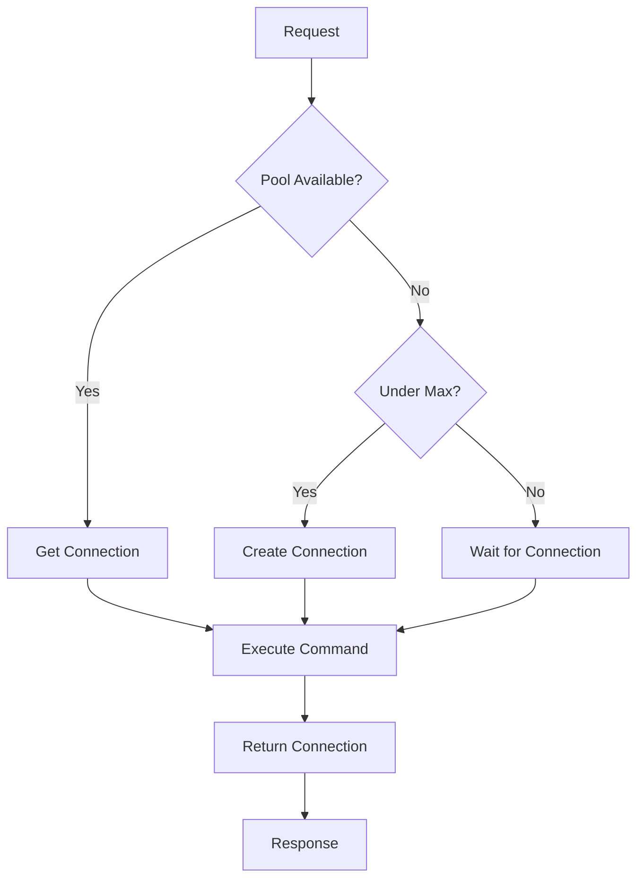
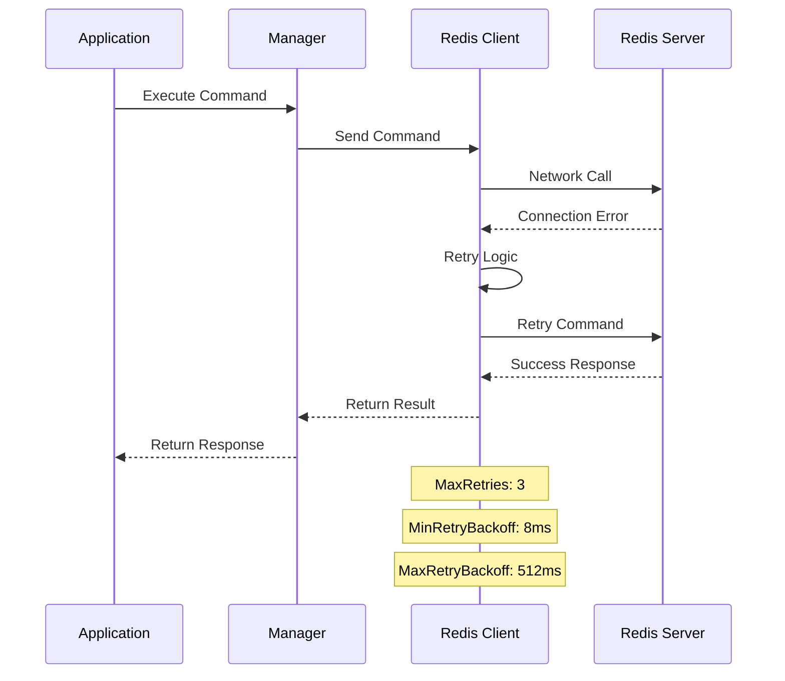

# Tổng quan kiến trúc Redis Client Library

## Giới thiệu

Go Fork Redis Client Library được thiết kế theo nguyên tắc **Dependency Injection** và **Configuration Management**, cung cấp một giải pháp toàn diện để quản lý kết nối Redis trong các ứng dụng Go hiện đại.

## Kiến trúc tổng thể



## Thành phần chính

### 1. ServiceProvider

**Mục đích**: Quản lý vòng đời và khởi tạo các thành phần Redis client



**Chức năng chính**:
- Đăng ký dependencies vào DI container
- Khởi tạo Redis clients dựa trên cấu hình
- Quản lý lifecycle của connections
- Validation cấu hình

### 2. Manager Interface

**Mục đích**: Cung cấp interface thống nhất để thao tác với Redis

```go
type Manager interface {
    // Basic operations
    Get(ctx context.Context, key string) (string, error)
    Set(ctx context.Context, key string, value interface{}, expiration time.Duration) error
    Del(ctx context.Context, keys ...string) (int64, error)
    
    // Advanced operations
    Exists(ctx context.Context, keys ...string) (int64, error)
    Expire(ctx context.Context, key string, expiration time.Duration) (bool, error)
    TTL(ctx context.Context, key string) (time.Duration, error)
    
    // Hash operations
    HGet(ctx context.Context, key, field string) (string, error)
    HSet(ctx context.Context, key string, values ...interface{}) (int64, error)
    HGetAll(ctx context.Context, key string) (map[string]string, error)
    
    // List operations
    LPush(ctx context.Context, key string, values ...interface{}) (int64, error)
    RPush(ctx context.Context, key string, values ...interface{}) (int64, error)
    LPop(ctx context.Context, key string) (string, error)
    RPop(ctx context.Context, key string) (string, error)
    
    // Set operations
    SAdd(ctx context.Context, key string, members ...interface{}) (int64, error)
    SMembers(ctx context.Context, key string) ([]string, error)
    
    // Pub/Sub
    Publish(ctx context.Context, channel string, message interface{}) (int64, error)
    Subscribe(ctx context.Context, channels ...string) *redis.PubSub
    
    // Pipeline
    Pipeline() redis.Pipeliner
    TxPipeline() redis.Pipeliner
    
    // Client access
    Client() redis.UniversalClient
    Close() error
}
```

### 3. Configuration System

**Mục đích**: Quản lý cấu hình linh hoạt cho các client types



## Luồng hoạt động

### 1. Khởi tạo ứng dụng



### 2. Xử lý request



### 3. Connection pooling



## Patterns và Best Practices

### 1. Dependency Injection Pattern

```go
// Đăng ký services
func setupDI() *di.Container {
    app := di.New()
    
    // Config provider
    app.Register("config", config.NewProvider())
    
    // Redis provider
    app.Register("redis", redis.NewServiceProvider())
    
    return app
}

// Sử dụng trong handler
func (h *Handler) GetUser(ctx context.Context, userID string) (*User, error) {
    // Manager được inject thông qua DI
    userKey := fmt.Sprintf("user:%s", userID)
    
    data, err := h.redis.Get(ctx, userKey)
    if err != nil {
        return nil, err
    }
    
    var user User
    if err := json.Unmarshal([]byte(data), &user); err != nil {
        return nil, err
    }
    
    return &user, nil
}
```

### 2. Configuration Pattern

```yaml
# config/app.yaml
redis:
  # Standard client for simple use cases
  client:
    enabled: false
    addr: "localhost:6379"
    password: ""
    db: 0
    
  # Universal client for production
  universal:
    enabled: true
    addrs:
      - "redis-cluster-1:6379"
      - "redis-cluster-2:6379"  
      - "redis-cluster-3:6379"
    password: "${REDIS_PASSWORD}"
    pool_size: 20
    min_idle_conns: 5
    max_idle_conns: 10
    tls:
      cert_file: "/etc/ssl/redis-client.crt"
      key_file: "/etc/ssl/redis-client.key"
      ca_file: "/etc/ssl/ca.crt"
```

### 3. Error Handling Pattern

```go
func (m *manager) Get(ctx context.Context, key string) (string, error) {
    result, err := m.client.Get(ctx, key).Result()
    if err != nil {
        if err == redis.Nil {
            return "", ErrKeyNotFound
        }
        return "", fmt.Errorf("redis get error: %w", err)
    }
    return result, nil
}
```

## Performance Characteristics

### 1. Connection Pooling



### 2. Memory Management

- **Connection Reuse**: Tái sử dụng connections để giảm overhead
- **Idle Timeout**: Tự động đóng connections không sử dụng
- **Max Lifetime**: Giới hạn tuổi thọ connection để tránh memory leak
- **FIFO/LIFO Pool**: Tối ưu pattern sử dụng connection

### 3. Failure Handling



## Tích hợp với các framework

### 1. Gin Framework

```go
func main() {
    // Setup DI
    app := setupDI()
    
    // Setup Gin
    r := gin.Default()
    
    // Middleware để inject dependencies
    r.Use(func(c *gin.Context) {
        var manager redis.Manager
        app.Resolve("redis.manager", &manager)
        c.Set("redis", manager)
        c.Next()
    })
    
    r.GET("/user/:id", getUserHandler)
    r.Run()
}
```

### 2. Echo Framework

```go
func main() {
    // Setup DI
    app := setupDI()
    
    // Setup Echo
    e := echo.New()
    
    // Middleware
    e.Use(func(next echo.HandlerFunc) echo.HandlerFunc {
        return func(c echo.Context) error {
            var manager redis.Manager
            app.Resolve("redis.manager", &manager)
            c.Set("redis", manager)
            return next(c)
        }
    })
    
    e.GET("/user/:id", getUserHandler)
    e.Start(":8080")
}
```

## Monitoring và Observability

### 1. Metrics Collection

```go
// Custom metrics wrapper
type MetricsManager struct {
    redis.Manager
    metrics prometheus.Registerer
}

func (m *MetricsManager) Get(ctx context.Context, key string) (string, error) {
    start := time.Now()
    defer func() {
        duration := time.Since(start)
        // Record metrics
        m.recordMetric("get", duration)
    }()
    
    return m.Manager.Get(ctx, key)
}
```

### 2. Logging

```go
// Structured logging
func (m *manager) Get(ctx context.Context, key string) (string, error) {
    logger := log.With(
        "operation", "get",
        "key", key,
        "trace_id", getTraceID(ctx),
    )
    
    logger.Debug("executing redis get command")
    
    result, err := m.client.Get(ctx, key).Result()
    if err != nil {
        logger.Error("redis get failed", "error", err)
        return "", err
    }
    
    logger.Debug("redis get completed", "result_length", len(result))
    return result, nil
}
```

---

**Tiếp theo**: [Cấu hình chi tiết](configuration.md)
