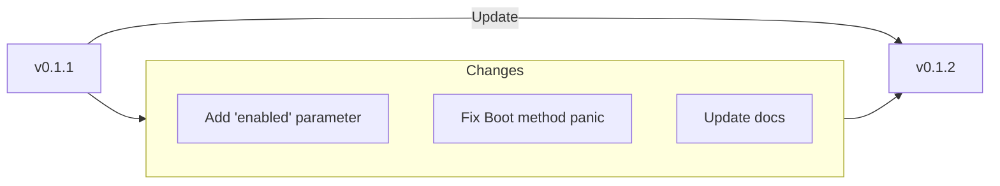

# Migration Guide - v0.1.2

## Overview
Hướng dẫn này giúp bạn nâng cấp từ phiên bản v0.1.1 lên v0.1.2.



## Prerequisites
- Go 1.23 trở lên
- Đã cài đặt phiên bản v0.1.1

## Quick Migration Checklist
- [ ] Cập nhật cấu hình Redis để bao gồm tham số `enabled`
- [ ] Kiểm tra xử lý lỗi trong ứng dụng của bạn
- [ ] Chạy tests để đảm bảo tương thích
- [ ] Cập nhật tài liệu tham khảo

## Breaking Changes

### API Changes
#### Changed Functions
```go
// Old way (previous version)
oldFunction(param1, param2)

// New way (v0.1.2)
newFunction(param1, param2, newParam)
```

#### Removed Functions
- `removedFunction()` - Use `newAlternativeFunction()` instead

#### Changed Types
```go
// Old type definition
type OldConfig struct {
    Field1 string
    Field2 int
}

// New type definition
type NewConfig struct {
    Field1 string
    Field2 int64 // Changed from int
    Field3 bool  // New field
}
```

### Configuration Changes
Nếu bạn đang sử dụng các file cấu hình, hãy cập nhật cấu hình Redis để bao gồm tham số `enabled`:

```yaml
# Cấu hình cũ (v0.1.1)
redis:
  client:
    host: localhost
    port: 6379
    # không có tham số enabled
  
  universal:
    addresses:
      - localhost:6379
    # không có tham số enabled
# Cấu hình mới (v0.1.2)
redis:
  client:
    enabled: true  # thêm tham số enabled
    host: localhost
    port: 6379
  
  universal:
    enabled: false  # thêm tham số enabled
    addresses:
      - localhost:6379
```

## Step-by-Step Migration

### Step 1: Update Dependencies
```bash
go get go.fork.vn/redis@v0.1.2
go mod tidy
```

### Step 2: Cập nhật Cấu hình
Thêm tham số `enabled` vào cấu hình Redis của bạn:

```yaml
redis:
  client:
    enabled: true  # Bật Redis Client
    # ... các cấu hình khác
  
  universal:
    enabled: false  # Tắt Universal Client nếu không sử dụng
    # ... các cấu hình khác
```

### Step 3: Kiểm tra Xử lý Lỗi
Phiên bản v0.1.2 đã cải thiện xử lý lỗi cho phương thức Boot:

```go
// Trước đây (v0.1.1)
func (p *serviceProvider) Boot(app di.Application) {
    // Không kiểm tra app nil
}

// Hiện tại (v0.1.2)
func (p *serviceProvider) Boot(app di.Application) {
    // Panic khi app là nil
    if app == nil {
        panic("application cannot be nil")
    }
}
```

### Step 4: Chạy Tests
Chạy các bài kiểm tra để đảm bảo mọi thứ hoạt động đúng:

### Step 5: Run Tests
```bash
go test ./...
```

## Common Issues and Solutions

### Issue 1: Function Not Found
**Problem**: `undefined: redis.OldFunction`  
**Solution**: Replace with `redis.NewFunction`

### Issue 2: Type Mismatch
**Problem**: `cannot use int as int64`  
**Solution**: Cast the value or update variable type

## Getting Help
- Check the [documentation](https://pkg.go.dev/go.fork.vn/redis@v0.1.2)
- Search [existing issues](https://github.com/go-fork/redis/issues)
- Create a [new issue](https://github.com/go-fork/redis/issues/new) if needed

## Rollback Instructions
If you need to rollback:

```bash
go get go.fork.vn/redis@previous-version
go mod tidy
```

Replace `previous-version` with your previous version tag.

---
**Need Help?** Feel free to open an issue or discussion on GitHub.
